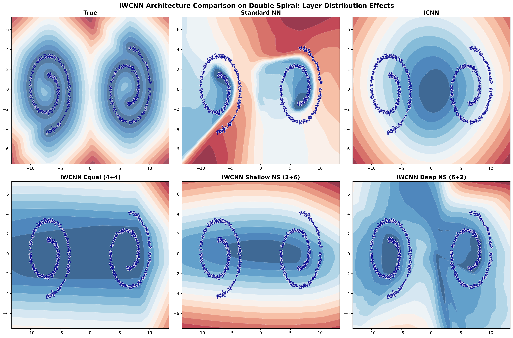
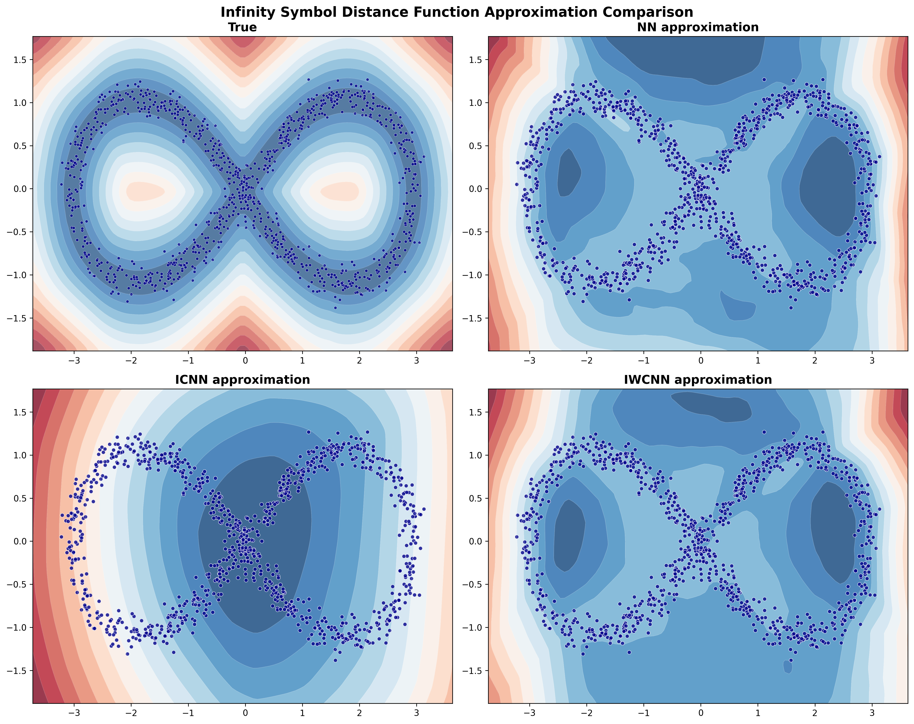
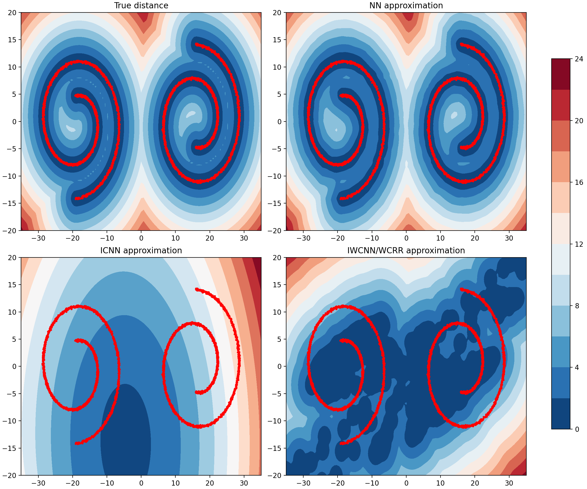
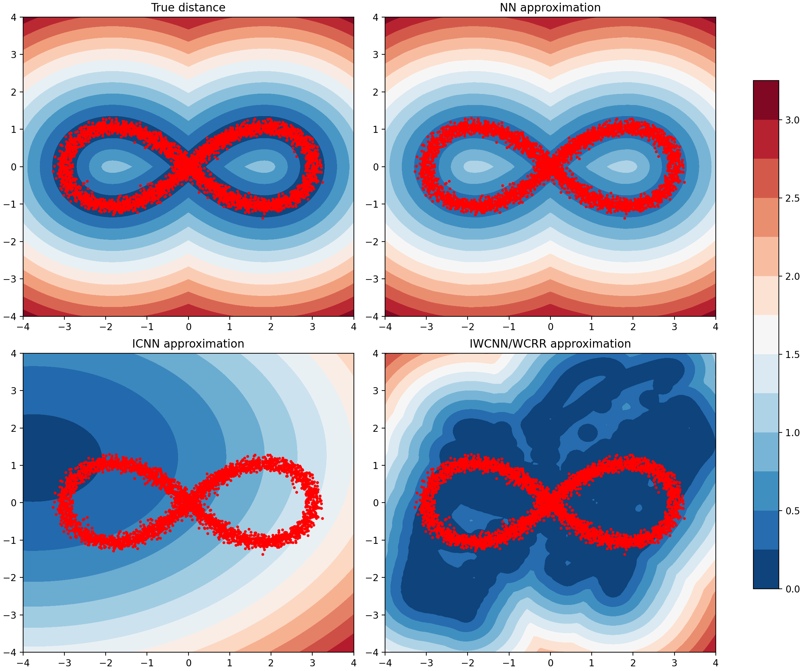

# Weakly Convex Regularisation: Project Summary

## Overview
This project investigates **learned convex and weakly convex regularisers** for inverse problems, based on two recent approaches:
- **Cambridge**: Input Convex / Weakly Convex Neural Networks (ICNN, IWCNN).  
- **EPFL**: Weakly Convex Convolutional Regulariser (WCRR).  

The aim is to understand the **expressiveness, stability, and convergence** of these models by learning distance functions to low-dimensional manifolds.

## Methods
- **Cambridge**: NN, ICNN, IWCNN with varying layer splits (e.g., 6+2, 4+4).  
- **EPFL**: Convolutional architecture with spline activations and weak convexity control.  

Both are trained to approximate distance functions on synthetic datasets.

## Experiments
Synthetic 2D manifolds are used as benchmarks:
- Circle, two circles  
- Swiss roll, double swiss roll  
- Infinity symbol  

We train and compare NN, ICNN, IWCNN, and WCRR in terms of:
- Distance field visualisation  
- Loss curves and convergence behaviour  

## Repository Structure
Main scripts for running experiments:
- `Cambridge_double_swiss_roll.py` – Cambridge ICNN/IWCNN on the double swiss roll.  
- `Cambridge_infinity_symbol.py` – Cambridge ICNN/IWCNN on the infinity symbol.  
- `EPFL_double_swiss_roll.py` – EPFL WCRR method on the double swiss roll.  
- `EPFL_infinity_symbol.py` – EPFL WCRR method on the infinity symbol.  

Each script includes **data generation, training, and evaluation** for the respective manifold.

## Results
Below are representative results for Cambridge and EPFL methods:

- Cambridge double swiss roll:  
  

- Cambridge infinity symbol:  
  

- EPFL double swiss roll:  
  

- EPFL infinity symbol:  
  

## Next Steps
Future work will extend IWCNN/WCRR models to **image denoising and reconstruction tasks** (e.g., CT), where stability and learned priors are crucial.

---

*This repository contains code for data generation, training, and visualisation of all experiments.*

