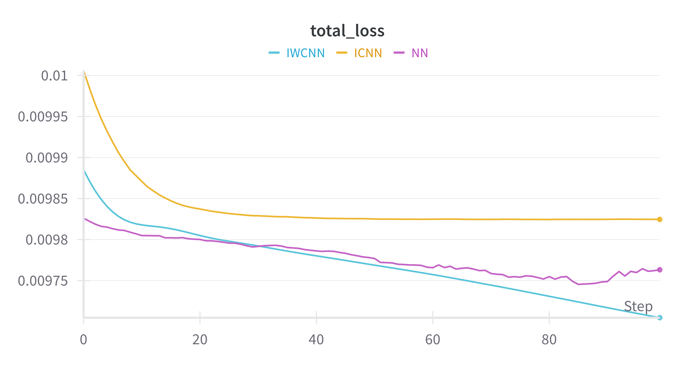
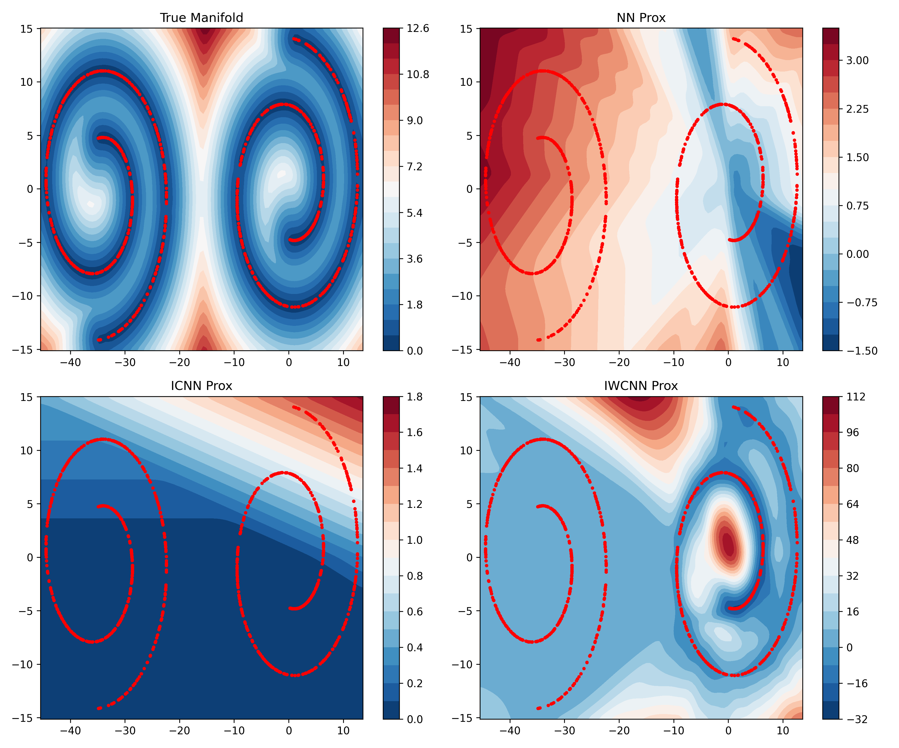

# Weakly Convex Regularisation: Technical Summary

## 1. Problem Overview

The objective of this project is to investigate and reproduce the method of weakly convex regularisers for inverse problems, as introduced in the Cambridge paper. The goal is to learn data-adaptive regularisation functions via neural networks and apply them through proximal minimisation in a denoising context. This work also sets the stage for later exploration of the EPFL framework.

## 2. Methodological Framework

### 2.1 Variational Denoising Formulation

We define the denoising energy functional:

$$
E(x; x^{\text{true}}) = \|x - x^{\text{true}}\|^2 + \alpha R_{\theta}(x)
$$

* $x^{\text{true}}$: clean data point on the manifold.
* $x$: denoised point.
* $R_{\theta}$: learnable regularisation function parameterised by neural network weights $\theta$.
* $\alpha$: regularisation strength.

The solution is obtained by computing the proximal operator:

$$
x^{\text{denoised}} = \operatorname{prox}_{R_{\theta}}(x^{\text{noisy}})
$$

### 2.2 Proximal Operator Implementation

The proximal operator is approximated via unrolled gradient descent:

$$
\text{prox}_{R_{\theta}}(x) \approx \arg\min_x \left( \|x - x^{\text{noisy}}\|^2 + \alpha R_{\theta}(x) \right)
$$

This approach allows differentiability through the prox steps, enabling end-to-end learning.

## 3. Regulariser Architectures

### 3.1 NN (Standard Neural Network)

* Multi-layer perceptron without convexity constraints.
* Acts as baseline.

### 3.2 ICNN (Input Convex Neural Network)

* Ensures convexity by clamping all layer weights to be non-negative.
* Uses ReLU activations.
* Conforms to theoretical requirements for convex regularisers.

### 3.3 IWCNN (Input Weakly Convex Neural Network)

* Combines a base MLP with an explicit quadratic term $\lambda \|x\|^2$.
* Enforces weak convexity.
* Uses smooth activations (Softplus).

## 4. Model Configuration Details

### 4.1 Weight Initialisation

* All models are initialised with fixed random seeds for reproducibility.
* ICNN weights are initialised uniformly in the positive range $[0.01, 0.1]$ to ensure non-negativity.
* IWCNN quadratic weights are initialised to a constant positive value.

### 4.2 Network Architecture & Depth

* All models use three fully connected layers:

  * Input dimension: 2
  * Hidden layers: two layers with 64 units each
  * Output dimension: 1
* Activation Functions:

  * NN: ReLU
  * ICNN: ReLU (with enforced convexity)
  * IWCNN: Softplus + quadratic regularisation term

### 4.3 Optimisation Method

* Optimiser: Adam
* Learning rate: typically $1 \times 10^{-3}$
* Proximal operator steps: 10 unrolled gradient steps with fixed step size

### 4.4 Loss Function and Metrics

* Loss: Mean Squared Error (MSE) between denoised points and true clean data.

* Optional symmetry loss may be added in future for Swiss roll symmetry enforcement.

* Metrics tracked:

  * Total Loss
  * MSE Loss

* All losses and metrics are logged and visualised through Weights & Biases (W\&B), including real-time loss curves.

## 5. Experiment Tracking

### 5.1 Training Loss Curves

* All experiments are logged using **Weights & Biases (W\&B)**:

  * Loss curves: total loss and MSE.
  * Model names: 'NN', 'ICNN', 'IWCNN'.
  * Hyperparameters: $\alpha$, learning rate, epochs.
  * Optional: weight histograms and gradient tracking.

## 6. Visualisation

* Contour plots show:

  * Ground truth manifold distance (via nearest neighbour geodesic approximation).
  * Learned regulariser outputs (NN, ICNN, IWCNN).
* Colour scheme: RdBu\_r with Gaussian smoothing.

## 7. Next Steps

* Validate and analyse symmetry, convergence and loss trends.
* Explore applications to imaging problems (X-ray CT, PAT).
* Potentially incorporate EPFL's strictly convex functional for comparison.

---

This document serves as a concise technical reference for current work and ongoing discussion.
