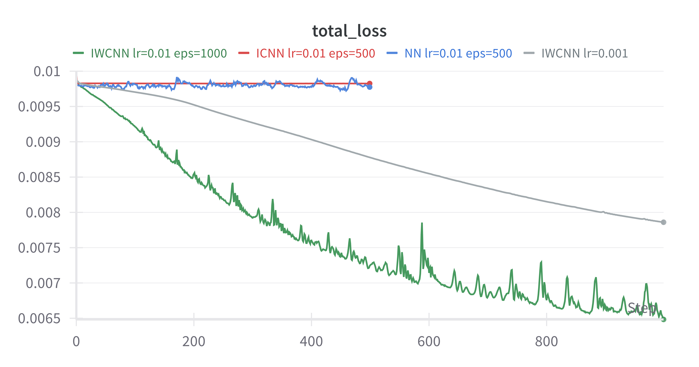

# Weakly Convex Regularisation: Technical Summary

## 1. Problem Overview

The objective of this project is to investigate and reproduce the method of weakly convex regularisers for inverse
problems, as introduced in the Cambridge paper "Weakly Convex Regularisers for Inverse Problems: Convergence of Critical
Points and Primal-Dual Optimisation" and the EPFL paper "Learning Weakly Convex Regularizers for Convergent
Image-Reconstruction Algorithms". The goal is to learn data-adaptive regularisation functions via neural networks and
apply them through proximal minimisation in a denoising context, specifically using the Swiss Roll dataset as a test
case. This work lays the foundation for extending these methods to image reconstruction tasks, such as CT image
reconstruction, by adapting the Cambridge weakly convex regularisation neural networks (NN, ICNN, IWCNN) and the EPFL
convolutional model (WCvxConvNet) to handle more complex imaging inverse problems.

## 2. Methodological Framework

### 2.1 Variational Denoising Formulation

We define the denoising energy functional:

$$
E(x; x^{\text{true}}) = \|x - x^{\text{true}}\|^2 + \alpha R_{\theta}(x)
$$

- \(x^{\text{true}}\): clean data point on the manifold.
- \(x\): denoised point.
- \(R_{\theta}\): learnable regularisation function parameterised by neural network weights \(\theta\).
- \(\alpha\): regularisation strength.

The solution is obtained by computing the proximal operator:

$$
x^{\text{denoised}} = \operatorname{prox}_{R_{\theta}}(x^{\text{noisy}})
$$

This formulation is implemented in both codebases, with `2d_swiss_roll.py` focusing on standard neural network
architectures (NN, ICNN, IWCNN) and `train_wcrr_swiss_roll.py` adapting the EPFL framework's convolutional approach.

### 2.2 Proximal Operator Implementation

The proximal operator is approximated via unrolled gradient descent:

$$
\text{prox}_{R_{\theta}}(x) \approx \arg\min_x \left( \|x - x^{\text{noisy}}\|^2 + \alpha R_{\theta}(x) \right)
$$

- In `2d_swiss_roll.py`, this is implemented with a fixed number of steps (5 by default) and a learning rate (0.05),
  allowing end-to-end differentiability.
- In `train_wcrr_swiss_roll.py`, the `grad_denoising` method of `WCvxConvNet` implicitly computes the proximal update,
  leveraging gradient-based optimisation.

## 3. Work Content

This project implements two experimental setups for Swiss Roll denoising:

- **Cambridge Implementation (`2d_swiss_roll.py`)**: Replicates the Figure 1 experiment from the Cambridge paper, using
  NN, ICNN, and IWCNN to learn regularisers and visualise their denoising performance.
- **EPFL Implementation (`train_wcrr_swiss_roll.py`)**: Adapts the EPFL paper's weakly convex regulariser
  model (`WCvxConvNet`) to the Swiss Roll dataset, focusing on convolutional architectures and spline-based activations.

Both implementations generate synthetic Swiss Roll data, add Gaussian noise, and evaluate the regularisers' ability to
recover the underlying manifold structure.

## 4. Mathematical Logic

### 4.1 Cambridge Approach

- The regularisation function \(R_{\theta}\) is learned to distinguish clean (\(\mathbb{P}_r\)) and noisy (\(\mathbb{P}
  _n\)) distributions, with an adversarial loss inspired by (5.1):
  \[
  \mathbb{E}_{X \sim \mathbb{P}_r} [R_\theta(X)] - \mathbb{E}_{X \sim \mathbb{P}_n} [R_\theta(X)] + \lambda \cdot
  \mathbb{E} \left[ \|\nabla_x R_\theta(X)\| - 1 \right]^2
  \]
    - The first two terms encourage \(R_\theta\) to be small on \(\mathbb{P}_r\) and large on \(\mathbb{P}_n\).
    - The WGAN gradient penalty (\(\lambda \cdot \mathbb{E} [\|\nabla_x R_\theta(X)\| - 1]^2\)) enforces 1-Lipschitz
      continuity.
- The proximal operator minimises this energy, with \(\alpha\) controlling the trade-off between data fidelity and
  regularisation.

### 4.2 EPFL Approach

- The `WCvxConvNet` model enforces weak convexity via a penalty term (\(\rho_{\text{wcvx}} = 1.0\)) and uses
  spline-based activations to approximate non-linear mappings.
- The denoising objective is framed as a gradient-based update, minimising MSE between denoised and clean data, with the
  regulariser implicitly embedded in the network architecture.

## 5. Code Logic

### 5.1 Cambridge Implementation (`2d_swiss_roll.py`)

- **Data Generation**: Creates two Swiss Rolls, rotates and shifts one, stacks them, centers the data, and adds Gaussian
  noise.
- **Training Loop**: Uses `train_with_prox` to iteratively update model parameters with Adam optimiser and
  CosineAnnealingLR scheduler. Incorporates (5.1) loss with WGAN constraints.
- **Models**:
    - **NN**: A standard MLP with SiLU activations.
    - **ICNN**: Enforces convexity with non-negative weights and ReLU.
    - **IWCNN**: Adds a quadratic term for weak convexity.
- **Visualization**: Generates contour plots comparing true manifold distances with model predictions.

### 5.2 EPFL Implementation (`train_wcrr_swiss_roll.py`)

- **Data Generation**: Produces a grid-based Swiss Roll dataset, reshaped into [H, W, 2] format for convolutional
  processing.
- **Training Loop**: Trains `WCvxConvNet` with MSE loss over 3000 epochs, saving the model state.
- **Visualization**: Plots ground truth and fitted manifold distances using nearest neighbor approximations.
- **Model Configuration**: Defines convolutional layers, spline activations, and scaling parameters to enforce weak
  convexity.

## 6. Technical Details

### 6.1 Hyperparameters

- **Cambridge**: \(\alpha = 0.1-0.2\), \(\lambda_{\text{wgan}} = 10.0\), epochs = 100-200, lr = \(5e-4\) to \(1e-3\).
- **EPFL**: epochs = 3000, lr = \(1e-3\), noise_level = 0.1, grid_size = 63.
- Batch size = 32 (Cambridge), 1 (EPFL) due to grid-based input.

### 6.2 Neural Network Algorithms

- **Cambridge**:
    - **NN**: 3-layer MLP (128 units), SiLU activation.
    - **ICNN**: 3-layer convex network with ReLU, non-negative weights.
    - **IWCNN**: 3-layer network with LeakyReLU and quadratic term (\(\lambda_{\text{reg}} = 0.2\)).
- **EPFL**: `WCvxConvNet` with multi-convolutional layers (2, 4, 8, 60 channels), spline activations (100 knots,
  clamped), and weak convexity penalty.

### 6.3 Optimisation and Stability

- Both use Adam optimiser with learning rate scheduling.
- Cambridge adds WGAN gradient penalty for stability; EPFL relies on spline clamping and weak convexity constraints.

## 7. Regulariser Architectures

### 7.1 NN (Standard Neural Network)

- Multi-layer perceptron without convexity constraints.
- Acts as baseline.

### 7.2 ICNN (Input Convex Neural Network)

- Ensures convexity by clamping all layer weights to be non-negative.
- Uses ReLU activations.
- Conforms to theoretical requirements for convex regularisers.

### 7.3 IWCNN (Input Weakly Convex Neural Network)

- Combines a base MLP with an explicit quadratic term \(\lambda \|x\|^2\).
- Enforces weak convexity.
- Uses smooth activations (LeakyReLU).

### 7.4 WCvxConvNet (EPFL Model)

- Convolutional architecture with spline-based activations and scaling.
- Enforces weak convexity via \(\rho_{\text{wcvx}}\) and gradient denoising.

## 8. Model Configuration Details

### 8.1 Weight Initialisation

- All models are initialised with fixed random seeds for reproducibility.
- ICNN weights are initialised in \([0.01, 0.1]\) for non-negativity.
- IWCNN quadratic weights are set to 0.1.
- EPFL model uses spline initialisation (leaky_relu or identity).

### 8.2 Network Architecture & Depth

- **Cambridge**: 3 fully connected layers (input=2, hidden=64 or 128, output=1).
- **EPFL**: Convolutional layers with channel progression (2, 4, 8, 60), spline layers with 60 activations.

### 8.3 Optimisation Method

- Optimiser: Adam.
- Learning rate: \(1e-3\) (adjustable in Cambridge).
- Proximal steps: 5 (Cambridge), implicit in EPFL.

### 8.4 Loss Function and Metrics

- **Cambridge**: MSE + adversarial loss with WGAN penalty.
- **EPFL**: MSE loss.
- Metrics: Total loss, MSE (logged via W&B in Cambridge).

## 9. Experiment Tracking

### 9.1 Training Loss Curves

- All Cambridge experiments are logged using **Weights & Biases (W&B)**:
    - Loss curves: total loss and MSE.
    - Model names: 'NN', 'ICNN', 'IWCNN'.
    - Hyperparameters: \(\alpha\), learning rate, epochs.

## 10. Visualisation

- **Cambridge**: Contour plots show ground truth manifold distance and learned regulariser outputs (NN, ICNN, IWCNN).
- **EPFL**: Plots ground truth distance and fitted manifold by WCRR.
- Colour scheme: RdBu_r with Gaussian smoothing.

## 11. Next Steps

- Validate symmetry, convergence, and loss trends for both Cambridge and EPFL implementations on the Swiss Roll dataset.
- Extend the Cambridge weakly convex regularisation neural networks (NN, ICNN, IWCNN) and the EPFL WCvxConvNet model to image reconstruction tasks, starting with CT image reconstruction.
- Explore the adaptation of these models to handle 2D/3D imaging data, including preprocessing of CT projections and evaluation metrics (e.g., PSNR, SSIM).
- Compare the performance of Cambridge and EPFL approaches with strictly convex functionals in the context of image reconstruction.
- Investigate the impact of varying \(\lambda_{\text{reg}}\) (Cambridge) and \(\rho_{\text{wcvx}}\) (EPFL) on reconstruction quality and convergence.

